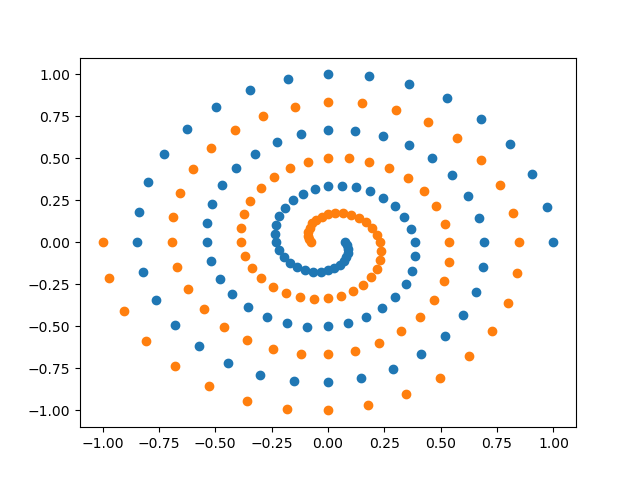

## Machine_learning-svm guide
本文件夹中包含如下四个文件：`svm_dataplot.py`, `svm_linear.py`, `svm_scikitlearn.py`, `svm_spiraldata.py`。其中，`svm_linear.py`, `svm_scikitlearn.py`, `svm_spiraldata.py`三个文件是使用**svm方法**进行二分类。`svm_dataplot.py`则是在打印了数据集。

### `svm_linear.py`
首先，调用`simple_synthetic_data`函数，生成了可以线性分类的数据集。  
然后使用线性分类核函数`default_ker(x, z)`: $rev = \bm x^T \bm z$, 在`svm_smo`分类器下进行分类

### `svm_spiraldata.py`
这里使用的数据集是`input/spiral.txt`中的螺旋形状的数据集，显然，不适合使用线性分类器。  
  
采用两种核函数`default_ker(x, z)`和`rbf_ker(x, z)`，使用`svm_smo`分类器下进行分类。  
- 核函数`default_ker(x, z)`: $rev = \bm x^T \bm z$
- 核函数`rbf_ker(x, z)`: $rev = \exp (- (\bm x - \bm z) ^T (\bm x - \bm z)) / (2 \sigma ^2)$

### `svm_scikitlearn.py`
这里使用的数据集是`input/spiral.txt`中的螺旋形状的数据集。并且采用`scikit-learn`中的`sklearn.svm.SVC`进行分类